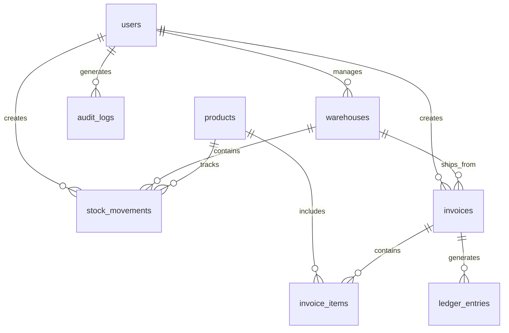

# ERP Database Migrations Guide

This document provides comprehensive information about the ERP system database migrations, including multiple migration approaches and sample data.

## 📁 Migration Files Structure

```
backend/src/
├── migrations/
│   ├── knex/                    # Knex.js migration files
│   │   ├── 001_create_users_table.js
│   │   ├── 002_create_roles_table.js
│   │   ├── 003_create_warehouses_table.js
│   │   ├── 004_create_products_table.js
│   │   ├── 005_create_stock_movements_table.js
│   │   ├── 006_create_invoices_table.js
│   │   ├── 007_create_invoice_items_table.js
│   │   ├── 008_create_ledger_entries_table.js
│   │   ├── 009_create_audit_logs_table.js
│   │   └── 010_create_change_logs_table.js
│   ├── sequelize/               # Sequelize migration files
│   │   ├── 20240101000001-create-users.js
│   │   ├── 20240101000002-create-roles.js
│   │   ├── 20240101000003-create-warehouses.js
│   │   ├── 20240101000004-create-products.js
│   │   └── ...
│   ├── migrate.js               # Simple migration runner
│   └── migrate-all.js           # Complete migration runner
├── seeds/                       # Seed data files
│   ├── 001_seed_roles.js
│   ├── 002_seed_users.js
│   ├── 003_seed_warehouses.js
│   └── 004_seed_products.js
└── schema/                      # Raw SQL files
    ├── erp_schema.sql           # Complete schema
    └── seed_data.sql            # Sample data
```

## 🗄️ Database Tables

### Core Tables

1. **users** - User accounts and authentication
2. **roles** - Role-based access control
3. **warehouses** - Storage locations
4. **products** - Product catalog
5. **stock_movements** - Inventory tracking
6. **invoices** - Sales and purchase invoices
7. **invoice_items** - Invoice line items
8. **ledger_entries** - Accounting entries
9. **audit_logs** - System audit trail
10. **change_logs** - Data synchronization tracking

### Table Relationships



## 🚀 Migration Methods

### Method 1: Complete Migration (Recommended)

Run the complete migration with schema and seed data:

```bash
# Run complete migration
npm run migrate:all
```

This will:
- Create all tables with proper relationships
- Add all indexes for performance
- Insert sample data
- Set up triggers for updated_at timestamps

### Method 2: Knex.js Migrations

```bash
# Install dependencies
npm install

# Run migrations
npm run migrate:knex

# Run seeds
npm run seed:knex

# Rollback if needed
npm run migrate:knex:rollback
```

### Method 3: Sequelize Migrations

```bash
# Install dependencies
npm install

# Run migrations
npm run migrate:sequelize

# Run seeds
npm run seed:sequelize

# Undo if needed
npm run migrate:sequelize:undo
```

### Method 4: Raw SQL

Execute the SQL files directly:

```bash
# PostgreSQL
psql -U postgres -d erp_db -f src/schema/erp_schema.sql
psql -U postgres -d erp_db -f src/schema/seed_data.sql

# SQLite
sqlite3 data/erp.db < src/schema/erp_schema.sql
sqlite3 data/erp.db < src/schema/seed_data.sql
```

## 📊 Sample Data

### Users (3 users)
- **Super Admin**: admin@erp.com / admin123
- **Manager**: manager@erp.com / manager123  
- **Sales User**: sales@erp.com / user123

### Warehouses (2 warehouses)
- **Main Warehouse** (WH001): 50,000 sqft capacity
- **Secondary Warehouse** (WH002): 30,000 sqft capacity

### Products (5 products)
1. **Laptop Computer - Dell XPS 13** ($1,499.99)
2. **Wireless Mouse - Logitech MX Master 3** ($79.99)
3. **Office Chair - Herman Miller Aeron** ($1,299.99)
4. **Monitor - Samsung 27" 4K UHD** ($499.99)
5. **Desk Lamp - BenQ ScreenBar Plus** ($199.99)

### Additional Sample Data
- Stock movements for initial inventory
- Sample sales invoices
- Ledger entries for accounting
- Audit logs for tracking
- Change logs for synchronization

## 🔍 Database Indexes

### Performance Indexes

The schema includes comprehensive indexing for optimal performance:

#### Users Table
- `idx_users_email` - Fast email lookups
- `idx_users_role` - Role-based queries
- `idx_users_is_active` - Active user filtering

#### Products Table
- `idx_products_sku` - SKU lookups
- `idx_products_barcode` - Barcode scanning
- `idx_products_category` - Category filtering
- `idx_products_brand` - Brand filtering

#### Stock Movements Table
- `idx_stock_movements_product_warehouse` - Inventory queries
- `idx_stock_movements_type_date` - Movement reporting

#### Invoices Table
- `idx_invoices_type_status` - Invoice filtering
- `idx_invoices_customer_id` - Customer history

#### Audit Logs Table
- `idx_audit_logs_table_record` - Record history
- `idx_audit_logs_table_date` - Time-based queries

## 🔧 Environment Configuration

### Database Configuration

Update your `.env` file:

```env
# Database Type (sqlite or postgresql)
DB_TYPE=sqlite

# PostgreSQL Configuration
DB_HOST=localhost
DB_PORT=5432
DB_NAME=erp_db
DB_USER=postgres
DB_PASSWORD=password

# Migration Configuration
NODE_ENV=development
```

### Knex Configuration

The `knexfile.js` supports multiple environments:

- **development**: SQLite for local development
- **production**: PostgreSQL for production
- **test**: In-memory SQLite for testing

## 🧪 Testing Migrations

### Test Database Setup

```bash
# Create test database
NODE_ENV=test npm run migrate:knex
NODE_ENV=test npm run seed:knex
```

### Migration Testing

```bash
# Run tests
npm test

# Test with coverage
npm run test:coverage
```

## 🔄 Data Synchronization

### Change Logs

The `change_logs` table tracks all data changes for synchronization:

- **entity_type**: Type of entity changed
- **entity_id**: ID of the changed record
- **change_type**: Type of change (create, update, delete)
- **sync_status**: Synchronization status
- **sync_target**: Target system for sync

### Sync Workflow

1. Data changes are logged in `change_logs`
2. Background process picks up pending changes
3. Syncs with external systems
4. Updates sync status and retry logic

## 🚨 Troubleshooting

### Common Issues

#### Migration Fails
```bash
# Check database connection
npm run migrate:all

# Check specific migration
knex migrate:status
```

#### Seed Data Issues
```bash
# Clear and reseed
knex seed:run --specific=001_seed_roles.js
```

#### Index Creation Fails
- Check if indexes already exist
- Verify table structure
- Check database permissions

### Database Reset

```bash
# Drop all tables and recreate
knex migrate:rollback --all
knex migrate:latest
knex seed:run
```

## 📈 Performance Optimization

### Query Optimization

1. **Use Indexes**: All frequently queried columns are indexed
2. **Composite Indexes**: Multi-column indexes for complex queries
3. **Foreign Key Indexes**: Automatic indexes on foreign keys

### Maintenance

```sql
-- PostgreSQL maintenance
VACUUM ANALYZE;

-- Update table statistics
ANALYZE users, products, invoices;
```

## 🔐 Security Considerations

### Data Protection

1. **Password Hashing**: bcrypt with salt rounds 12
2. **Audit Logging**: All changes tracked
3. **Role-Based Access**: Granular permissions
4. **Data Validation**: Input validation at API level

### Backup Strategy

```bash
# PostgreSQL backup
pg_dump -U postgres erp_db > backup_$(date +%Y%m%d).sql

# SQLite backup
cp data/erp.db backup_$(date +%Y%m%d).db
```

## 📚 Additional Resources

- [Knex.js Documentation](https://knexjs.org/)
- [Sequelize Documentation](https://sequelize.org/)
- [PostgreSQL Documentation](https://www.postgresql.org/docs/)
- [SQLite Documentation](https://www.sqlite.org/docs.html)

---

**Note**: Always backup your database before running migrations in production!
